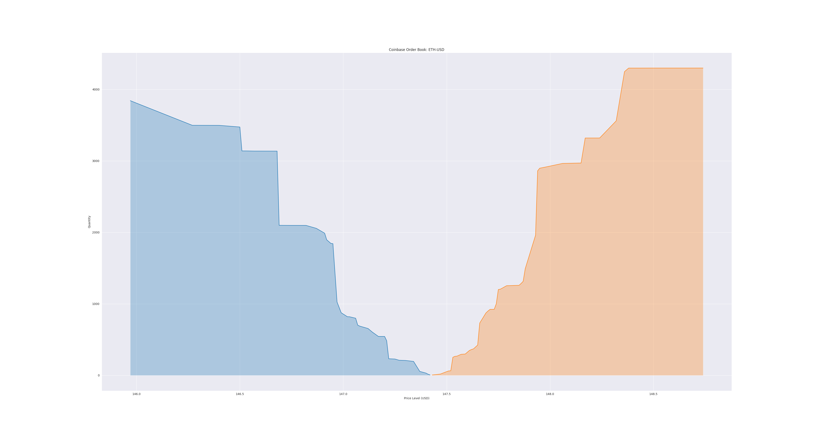

Quick Start
===========

This section outlines how to configure and deploy *antalla*. Make sure
you follow all the steps in :ref:`requirements` before proceeding.

Initializing the database
-------------------------

Once the ``DB_URL`` is set, the database can be initialized with the following
command:

::

   antalla init-data

Exchange Listeners
------------------

Exchange listeners have been implemented for the following centralised
exchanges (CEXs) and decentralised exchanges (DEXs).

CEX exchange listeners:

-  ☒ Binance
-  ☒ Coinbase Pro
-  ☒ HitBTC
-  ☐ Bitfinex
-  ☐ Gemini
-  ☐ itBit
-  ☐ bitFlyer
-  ☐ Kraken
-  ☐ Poloniex
-  ☐ Bitrex
-  ☐ Bitstamp
-  ☐ Bitmex
-  ☐ Huobi Global

DEX exchange listeners:

-  ☒ IDEX
-  ☐ EthDelta
-  ☐ DDEX
-  ☐ Kyber Network
-  ☐ Oasis Dex

For each exchange the API key and secret can be set via environment
variables in the format ``<EXCHANGE>_API_KEY`` and
``<EXCHANGE>_API_SECRET``, respectively.

.. _running-antalla-1:

Running *antalla*
-----------------

Once the DB is initialized, antalla can be run with the following
command

::

    antalla run

This will configure antalla to obtain data from the default exchanges and markets, which 
are specified and can be altered in ``settings.py``. To specify exchanges and markets via 
the command line, one can simply run the command:

::

   antalla run --exchange <exchange> --markets-files <markets-files>

Examples for ``markets-files`` can be found in the ``\data`` directory. 

The list of markets to listen for can be customized through the
``MARKET`` environment variable, which should be formatted as follow
``ETH_AURA,ETH_IDXM``.

Orderbook Snapshot Analysis
---------------------------

By setting the subparser argument

::

   antalla snapshot

a snapshot of each order book state will be computed and stored in the
``order_book_snapshots`` table in the db. The interval between the snapshots
is set to the default value of 1 second. By setting the ``--exchange``
flag snapshots only for a set of specified exchanges will be generated.

.. note::
   Snapshots are only generated for periods during which there has
   been aggregated order book data collected and no connection loss has
   occurred. Hence, for each period between a connection and disconnect for
   an exchange listener snapshots will be generated according to the set
   snapshot interval.

Each snapshot contains relevant metrics for the current state of the
order book at the time taken. The current metrics include:

- bid-ask spread
- bids count
- asks count
- bids volume
- asks volume
- bid price (mean) 
- ask price (mean)
- bid price (median)
- ask price (median)
- bid price (stddev)
- ask price (stddev)
- price and size of highest bid
- price and size of lowest ask

The order book depth per snapshot is configurable by setting the flag:
``--depth <percentage>``. The order book depth is specified as a
percentage relative to the mid price of the order book.

Alternatively, one may use the flag ``--quartile``, whereby snapshots
are computed for the upper quartile of bids and the lower quartile of
asks.

.. note::
   By default, a snapshot will be generated for the quartile range of
   the order book.

Connection Handling
-------------------

Currently, there is no web or command line interface for providing an
overview of the state of connections to different exchanges. This will
very likely be added in antalla 1.0. Nontheless, all connections and
disconnections are logged in the ``events`` table in the db. In case of
a disconnect, the event is logged and antalla tries to reconnect to the
service. Features which make use of data (e.g. snapshots) are only
applied to data within time periods between a connection and a
diosconnect (or latest data in case no disconnect has occured). This is
important when analysing computed statistics, as values may be skewed if
they are based on data within early periods of a new connection widow if
previous values have been based on an earlier window.

Visualisations
--------------

*antalla* comes with basic built-in functionality for generating
different order book plots. However, one should note that the 
predominant purpose of the tool lies on data aggregation.

Order Book Plots
^^^^^^^^^^^^^^^^

For generating real-time order book plots, use the command:

::

   antalla plot-order-book --exchange <exchange> --market <market_pair>

Here, ``<market_pair>`` has the format, e.g. ``ETH_BTC``. For a list of which markets and exchanges 
are valid arguments check with:

::

    antalla plot-order-book -exchange exchange

.. note::
   The ``--exchange`` and ``--market`` flags are required. Hence,
   visualising one market’s order book requires one single process.

The plots are generated, plotting all buy and sell orders that lie in a
range of +-1% of the order book mid price. Alternatively one can
configure the ``OrderBookAnalyser`` defined in ``ob_analyser.py`` to use
a method (``_get_ob_quartiles``) plotting all bids which lie in the
upper quartile of the total bids and all asks which lie within the lower
quartile of the total asks.
